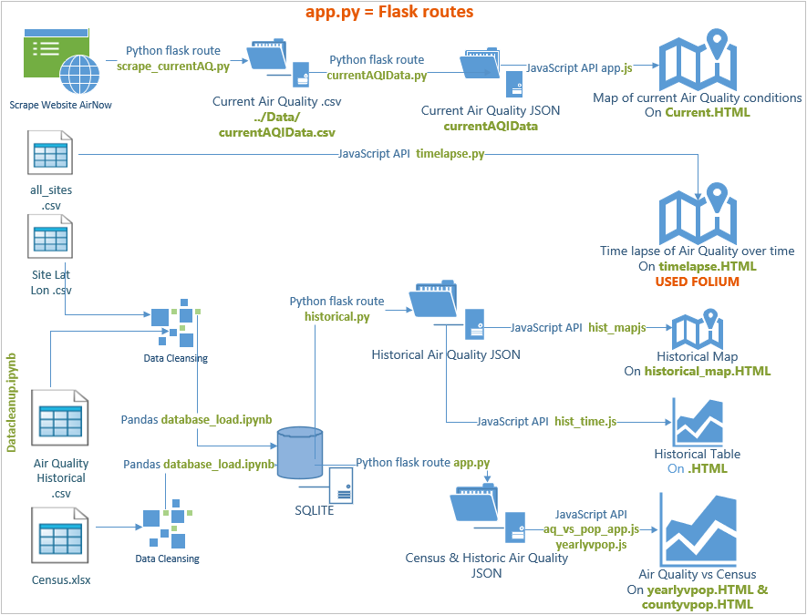

# California Air Quality Analysis

## Introduction
Hello and Welcome! You have stumbled upon the README for the California Air Quality Analysis Website. This README was designed to help you reconstruct the air quality products that allow the public and corportations make decisions that may impact human health and operations.

This is a Full-Stack project that will require back-end and front-end developers. Above is a Database Model that illustrates the work flow.

## Table of Contents
This README will be broken down by product with a full description of the Back-End and Front-End Process. The products developed for this project are listed below. Feel free to click on the hyperlink to jump to that section:
>- [Current Conditions](#Current Conditions)
>- [Historical Form](#Historical Form)
>- [Historical: Map](#Historical: Map)
>- [Time Lapse](#Time Lapse)
>- [County Air Quality vs. Population](#County Air Quality vs. Population)
>- [Yearly Air Quality vs. Population](#Yearly Air Quality vs. Population)

### Additional Information
For more information on how to setup and launch the project on [Heroku](https://www.heroku.com/), click [here](#Setup).

To see a file hiearchy of the project, click [here](#Project Contents).
To get to know the developers of this website, click [here](#Developers).
To get a brief overview of the Technologies, click [here](#Technologies).
Look for data sources? [Sources](#Data Sources).

## **Current Conditions**
The Current Conditions Product is an interactive map of California that displays the most recent and highest concentrated air quality for that city. The user can click on each marker for more information.

### Back-End Process
To acquire hourly air quality data, the developer will need to perform a web scrape from [AirNow.gov](https://www.airnow.gov/). A web scrape was used by the developer, but in order to prevent getting blocked by websites from too much scraping, a free API from AirNow.gov is highly recommended. The rate limit is 500 requests per hour, this should be more than enough for this project. In addition, the web scrape takes an estimated 15 minutes to complete. 

The web scrape, [scrape_currentAQ.py](static/py/scrape_currentAQ.py), was written in Python using dependencies like Splinter and Beautiful Soup for the scrape, Pandas to clean the csv data, and time to keep the program running every hour. The scrape will require a list of cities to loop through in order to build the query. This list is pulled from a CSV file, [ca_sites.csv](static/Data/ca_sites.csv). This file was pulled from the [United State Census Bureau](https://www.census.gov/data/datasets/time-series/demo/popest/2010s-total-cities-and-towns.html#ds) and cleaned with Pandas. After the scrape, the data gets converted into a DataFrame and is merged with ca_sites.csv to create a new CSV, [currentAQIData.csv](static/Data/currentAQIData.csv). This CSV will be used for the Front-End Process. In the future, it is recommended the developer convert the DataFrame to a JSON, rather a CSV. This will help prevent additional coding and steps. 

### Front-End Process
The Front-End Process was programmed in JavaScript, [app.js](static/js/app.js), using the Leaflet Library and Mapbox to create the map, and [HTML](templates/current.html) for the webpage. The developer will need to obtain an API Key from [MapBox](https://docs.mapbox.com/api/overview/).

The last step will be to wrap the currentAQIData.csv and current.html into a web application. This project used Flask Python, [app.py](app.py). 

## **Historical Form**
This project scrapes the current pollutants from the airnow website for California and displays the historical data of the state from 1/1/2010 to 10/31/2020.

### Back-End Process
XXX 

### Front-End Process
XXX

## **Historical: Map**
XXX

### Back-End Process
XXX 

### Front-End Process
XXX

## **Time Lapse**
XXX

### Back-End Process
XXX 

### Front-End Process
XXX

## **County Air Quality vs. Poplulation**
XXX

### Back-End Process
XXX 

### Front-End Process
XXX

## **Yearly Air Quality vs. Population**
XXX

### Back-End Process
XXX 

### Front-End Process
XXX

## **Setup**
To launch the project, please use the following link:  
https://aperez-air-quality-analysis.herokuapp.com

## **Project Contents**

## **Developers**
>- **Julia Headlee**  [Git Hub: julieheadlee](https://github.com/julieheadlee)
>- **Melanie Nolker** [Git Hub: mnolker](https://github.com/mnolker)
>- **Alicia Perez** [Git Hub: AliciaAPerez](https://github.com/AliciaAPerez)
>- **Kayla St. Germain** [Git Hub: KStG1992](https://github.com/KStG1992)

## **Technologies**
Project is created with:  
* HTML5
* Flask 1.1.2
* JavaScript 1.5
* Bootstrap 5.0.0
* Heroku 
* Flask-SQLAlchemy 2.4.4
* Pandas 1.1.5
* Python 3.6
* Jupyter Notebook 6.0.3
* SQLAlchemy 1.3.23
* pgAdmin 4

## **Data Sources**
>- Air Quality current: https://docs.airnowapi.org/HistoricalObservationsByLatLon/docs
>>- scrape current data for visualization of current air quality
>- Air Quality historical data: https://aqs.epa.gov/aqsweb/airdata/download_files.html
>>- csv to database (cleanse using pandas); Use Python flask route to pass data from PostgressSQL database
>- US Census:  
    >>- by county: https://www.census.gov/data/datasets/time-series/demo/popest/2010s-counties-total.html   
    >>- by city: https://www.census.gov/data/datasets/time-series/demo/popest/2010s-total-cities-and-towns.html  
>>- Use Python flask route to pass data from PostgressSQL database

## **Visuals:**
>- Topical graph with heatmap of Air Quality
>- Add layer to map to include demographic data
>- make interactive graph by picking date / county
>- Interactive map of air quality over time D3 folium JS library ? https://python-visualization.github.io/folium/

## **Overview:**
Database Map  
  

Project ERD  
  

